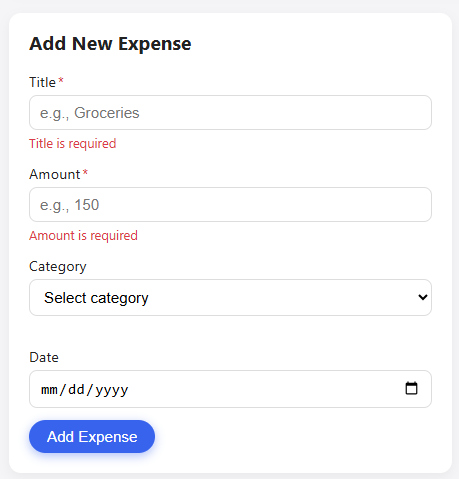

# Expense Tracker – Mini Budget App (Vite + JavaScript ES Modules)

A simple **Expense Tracker** built using **HTML, CSS, Vanilla JavaScript**, and now powered by **Vite** for a modern development experience.

This project allows users to record, manage, filter, and analyze expenses with a clean UI and a fully modular JavaScript architecture.

---

## 📸 Screenshots

### ➤ Add Expense Form (Empty)


---

### ➤ Validation Errors


---

### ➤ Expenses Table (After Adding Expenses)


---

### ➤ Full Dashboard View


---

## 📌 Project Description

This project is designed for students learning JavaScript fundamentals.  
It demonstrates:

- Working with the **DOM**
- Managing state using **arrays**
- Writing modular JS code with **ES Modules**
- Performing **form handling + validation**
- Using essential array methods:
  - `map`, `filter`, `find`, `reduce`, `forEach`
- Working with **Vite** for fast bundling, hot reload, and modern development

---

## 🚀 Features

### ✔️ Core Features
- Add new expenses with validation  
- Delete expenses  
- Filter by category  
- Sort by date  
- Auto-generated expense IDs  
- Display total & highest expense dynamically  
- Clean performance-friendly architecture  

---

## 📂 Project Structure

```
Frontend/
│
├── index.html
├── vite.config.js
├── README.md
├── .gitignore
│
├── src/
│   ├── assets/
│   │    └── for icons and images
│   ├── css/
│   │    └── style.css
│   ├── js/
│        ├── app.js
│        ├── dom.js
│        ├── state.js
│        ├── utils.js
│        └── validation.js
│
└── package.json
```

---

## ▶️ Running the Project (Vite)

### **Install dependencies**
```
npm install
```

### **Start development server**
```
npm run dev
```

Vite will launch at:

```
http://localhost:5173/
```

### **Build for production**
```
npm run build
```

### **Preview production build**
```
npm run preview
```

---

## 🛠️ Why Vite?

- Extremely fast dev server  
- Hot Module Reload (HMR)  
- Bundled and optimized production output  
- Native ES module support  
- Zero config needed for most projects  

---

## 🙌 Author

A simple educational project for mastering modern JavaScript development.

---

